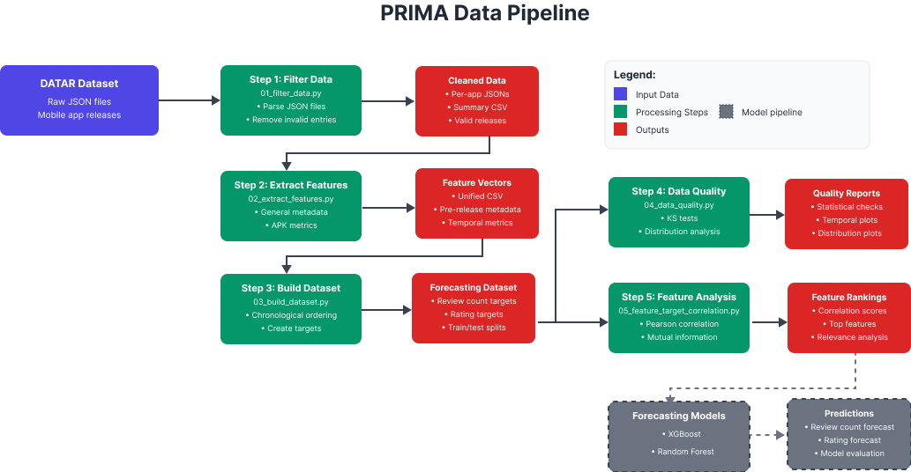

````markdown
# PRIMA: Forecasting Mobile App Release Impact with Metadata

PRIMA is a forecasting framework built on the [DATAR dataset](https://zenodo.org/records/10579421) to predict mobile app release outcomes using pre-release metadata. It supports forecasting user engagement (review count) and satisfaction (rating) via feature metadata analysis and temporal machine learning models.

#### Research objective

PRIMA’s contribution is not about beating baselines or making perfect predictions, which are very hard to define and beat in this problem setting.
Instead, the project wants to:
    1) **Show why forecasting is difficult** when relying on pre-release metadata, due to the volatility of review counts and the small range of ratings.
    2) **Highlight which features are most useful**, via correlation analysis and feature importance analysis.
    3) **Show that review counts are volatile**, and suggest to reframe the review count prediction as classification (e.g., low/medium/high ranges) or ranking, rather than pure regression.
    4) **Define PRIMA as the first full framework** for app release forecasting on the DATAR dataset, providing a reproducible framework and good baselines for future research.

---

### 1. Installation

```bash
cd prima
pip install -r requirements.txt
````

---

### 2. Data Setup

Download and unzip the [DATAR dataset](https://zenodo.org/records/10579421), in the following directory:

```
data/input/
```

The uncompressed directories should look like:

```
data/input/DATAR/release_related/all_jsons/
```

This folder should contain all raw `.json` files for mobile app releases.

---

### 3. Data Pipeline Overview

The pipeline consists of five modular stages, each producing outputs required for forecasting. These steps include data cleaning, feature extraction, dataset creation, and analysis of feature relevance.



#### Step 1: `01_filter_data.py` — Release Filtering

* Loads raw JSON files and parses release data.
* Filters out invalid entries (e.g., missing dates or <10 reviews).
* Retains apps with sufficient release history.
* Outputs:

  * Cleaned per-app JSON files.
  * A summary CSV with valid releases and key metadata.

#### Step 2: `02_extract_features.py` — Feature Extraction

* Computes structured feature vectors for each release using pre-release metadata only.
* Feature types:

  * General metadata (e.g., changelog length, release tags)
  * APK metrics (e.g., file size, SDK versions, component counts)
  * Development activity (e.g., issues, PRs, contributors)
  * Textual metrics (e.g., word count, sentence count, average word length)
  * Temporal metrics (e.g., time since previous release)
* Outputs a unified CSV containing features for all processed releases.

#### Step 3: `03_build_dataset.py` — Forecasting Dataset Construction

* Orders releases chronologically by app.
* Creates shifted forecasting targets:

  * `target_review_count`: number of reviews on the next release.
  * `target_average_rating`: average rating on the next release.
* Adds bucketed classification targets:

  * `target_review_bucket`: review count quantiles.
  * `target_rating_bucket`: rating score intervals.
* Splits each app’s release history into training and testing subsets based on a temporal cutoff.

#### Step 4: `04_data_quality.py` — Data Quality and Distribution Analysis

* Evaluates structural integrity of the train/test splits.
* Performs statistical checks (e.g., KS tests) to identify shifts in distributions.
* Plots temporal coverage and target distributions for both sets.

#### Step 5: `05_feature_target_correlation.py` — Feature Relevance Analysis

* Computes:

  * Pearson correlation (linear)
  * Spearman correlation (monotonic)
  * Mutual Information (nonlinear dependencies)
* Assesses how well each feature explains future review count and rating.
* Saves top-ranked features for downstream modeling and analysis.

---

### 4. Running the Full Data Generation Pipeline

You can execute all steps individually or via the orchestrator

**Step-by-step:**

```bash
python data_processing/01_filter_data.py
python data_processing/02_extract_features.py
python data_processing/03_build_dataset.py
python data_processing/04_data_quality.py
python data_processing/05_feature_target_correlation.py
```

**Run all at once (optional):**

```bash
python data_processing/run_full_pipeline.py
```

---

### 5. Forecasting Pipeline

#### Step 6: `06_train_models.py` — Model Training

* Trains forecasting models on the training dataset.
* Models implemented:

  * **Random Forest Regressor**
  * **XGBoost** (square error, Poisson, log1p-transformed)
  * **Huber Regressor** (for ratings, with scaling pipeline)
* Performs hyperparameter selection for XGBoost via cross-validation.
* Saves:
  * Trained models (`.joblib`)
  * Metadata (`meta_<target>.json`) including feature list, clip bounds, and CV details.

#### Step 7: `07_forecast_and_evaluate.py` — Forecasting & Evaluation

* Loads models from Step 6.
* Predicts on the test dataset only (strict temporal split).
* Computes strong **naive baselines** for comparison:

  * Last value baseline
  * Moving average (MA3)
  * Seasonal naive (optional)
* Evaluation metrics:

  * Counts: MAE, RMSE, RMSLE, sMAPE, MAPE
  * Ratings: MAE, RMSE, MdAE, R², Spearman correlation
* Outputs:

  * Per-model prediction CSVs
  * Metrics JSON files
  * Plots (predicted vs actual, residuals)
  * Worst-K error cases
  * Run manifest with all artifacts and metadata

---
